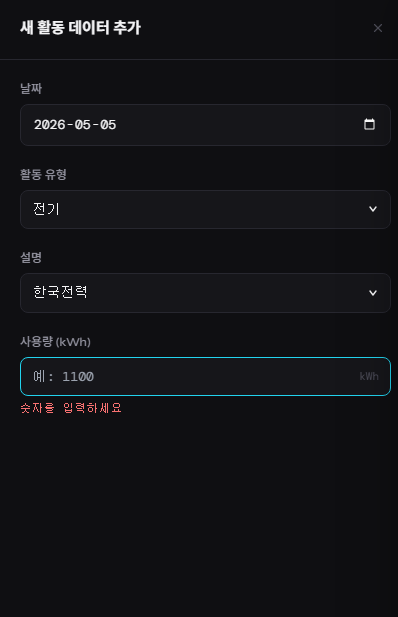
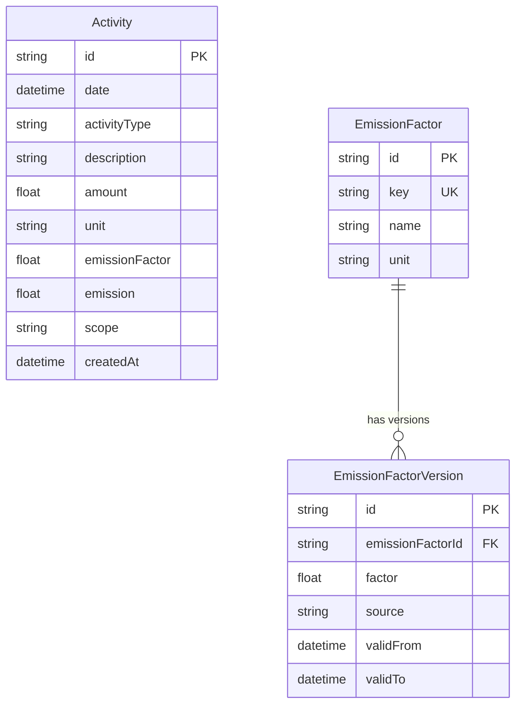

# Carbon Dashboard — PCF 탄소 배출 관리 플랫폼

제조업 실무자와 경영자를 위한 제품 탄소 발자국(PCF) 추적·시각화 대시보드입니다.  
전기·원소재·운송 데이터를 입력하면 GHG Protocol 기준 Scope 2/3 배출량을 자동 계산합니다.

🔗 배포 링크: https://tubular-dragon-f54d4f.netlify.app  
📹 데모 영상: (Loom 또는 YouTube 링크 추가)

---

## 로컬 실행 방법

```bash
# 1. 저장소 클론 및 의존성 설치
git clone https://github.com/bellkong7079/carbon-dashboard
cd carbon-dashboard && npm install

# 2. 환경 변수 설정
cp .env.example .env.local
# .env.local 열어서 DATABASE_URL 확인 (기본값으로 로컬 Docker 연결)

# 3. DB 실행
docker-compose up -d

# 4. 마이그레이션 및 시드 데이터 입력
npx prisma migrate deploy
npx prisma db seed

# 5. 서버 실행
npm run dev

# → http://localhost:3000           대시보드
# → http://localhost:3000/activities  활동 데이터
```

---

## 스크린샷

### 대시보드 메인


### 활동 데이터 입력 — 정상


### 활동 데이터 입력 — 에러 메시지


### Excel 업로드 결과


---

## 기술 스택 및 선택 이유

| 기술 | 선택 이유 |
|------|-----------|
| Next.js 14 App Router | 프론트+백엔드 통합, API Route Handler로 REST 직접 구현 |
| Prisma 5 + SQLite | 타입 안전한 DB 접근, 로컬 개발 시 별도 DB 설치 불필요 |
| Custom SVG 차트 | 외부 차트 라이브러리 없이 애니메이션·툴팁 직접 구현, 번들 크기 최소화 |
| SheetJS (xlsx) | Excel 업로드·다운로드 양방향 지원, 멀티시트 내보내기 |
| zod | 런타임 유효성 검사 + TypeScript 타입 자동 추론 |
| CSS Variables 다크 테마 | Tailwind 없이 일관된 디자인 토큰 시스템 구축 |

---

## 시스템 설계 — ERD



---

## 설계 결정 이유

### ① Activity에 emissionFactor를 스냅샷으로 저장
배출계수는 환경부 고시에 따라 매년 갱신됩니다.  
최신 계수로 과거 데이터를 재계산하면 역사적 추세 비교가 불가능해집니다.  
계산 시점의 계수를 스냅샷으로 저장해 감사 추적(audit trail)을 보장합니다.

### ② emission을 미리 계산하여 저장 (반정규화)
집계 API에서 매번 amount × factor를 계산하면 데이터 증가 시 DB 부하가 커집니다.  
저장 시 한 번 계산해 조회 성능을 최적화했습니다.  
(trade-off: 배출계수 변경 시 과거 데이터 재계산 배치 필요)

### ③ API Route Handler 사용 (Server Actions 미사용)
Excel 업로드, 외부 시스템 연동 가능성, Swagger 문서화를 고려하면  
명시적 REST API가 장기적으로 확장성이 좋습니다.  
Server Actions는 폼 제출에 최적화되어 있지만 이 프로젝트의 요구사항에는 REST가 적합합니다.

---

## 설계 Trade-off

### 반정규화 (emission 미리 계산 저장) vs 정규화 (조회 시 계산)

| 방식 | 장점 | 단점 |
|------|------|------|
| 미리 계산 저장 (채택) | 조회 성능 우수, 쿼리 단순 | 배출계수 변경 시 재계산 배치 필요 |
| 조회 시 실시간 계산 | 항상 최신 계수 반영 | 데이터 증가 시 집계 쿼리 느려짐 |

→ 탄소 회계에서 감사 추적이 중요하므로 스냅샷 + 미리 계산 방식 선택.  
  배출계수 변경 빈도가 낮고(연 1회 수준) 데이터가 증가할수록 조회 성능 이점이 큼.

---

## GHG Protocol Scope 분류

| Scope | 정의 | 이 프로젝트 |
|-------|------|-------------|
| Scope 1 | 직접 배출 (자체 연소 등) | 미포함 |
| Scope 2 | 구매 전기·열 사용 간접 배출 | 전기 (한국전력) |
| Scope 3 | 공급망 전반 간접 배출 | 원소재 조달, 운송 |

출처: GHG Protocol Corporate Standard (www.ghgprotocol.org)

---

## 타 시스템 비교

| 항목 | 이 시스템 | Salesforce Net Zero Cloud | Microsoft Sustainability Manager |
|------|-----------|--------------------------|----------------------------------|
| 주요 대상 | 단일 제품 PCF | 기업 전체 탄소 관리 | 기업 전체 ESG |
| 배출계수 관리 | 버전 이력 추적 | 내장 배출계수 DB | 내장 배출계수 DB |
| Excel 임포트 | ✅ 지원 | ✅ 지원 | ✅ 지원 |
| 커스터마이징 | 높음 (오픈소스) | 낮음 (SaaS) | 낮음 (SaaS) |
| 비용 | 오픈소스 무료 | 고가 엔터프라이즈 | 고가 엔터프라이즈 |
| 배포 | Vercel + Supabase | 클라우드 SaaS | 클라우드 SaaS |
| 적합 대상 | 스타트업·중소기업 | 대기업 | 대기업 |

→ 이 시스템은 빠른 도입과 커스터마이징이 필요한 중소 제조사에 최적화되어 있습니다.

---

## Vercel + Supabase 배포

### Step 1: Supabase DB 생성
1. https://supabase.com 회원가입
2. New Project 생성 (이름: carbon-dashboard, 리전: Northeast Asia)
3. Project Settings → Database → Connection string 복사

### Step 2: schema.prisma Supabase 용 수정
```prisma
datasource db {
  provider  = "postgresql"
  url       = env("DATABASE_URL")
  directUrl = env("DIRECT_URL")
}
```

### Step 3: Supabase에 마이그레이션 실행
```bash
npx prisma migrate deploy
npx prisma db seed
```

### Step 4: Vercel 환경 변수 설정
```
DATABASE_URL = [Supabase Transaction pooler URL]
DIRECT_URL   = [Supabase Direct connection URL]
NEXT_PUBLIC_APP_NAME = Carbon Dashboard
```

---

## AI 도구 사용 내역

| 도구 | 사용한 부분 | 사용한 프롬프트 요약 | 결정 이유 |
|------|-------------|---------------------|-----------|
| Claude Code | 전체 시스템 설계 및 코드 구현 | "탄소 관리 대시보드 풀스택 구현 — Prisma, API Route, UI 포함" | 초기 구조 빠르게 검증 |
| Claude Code | Prisma 스키마 설계 | "배출계수 버전 이력 추적 스키마 설계" | ERD 설계 시간 단축 |
| Claude Code | Custom SVG 차트 구현 | "Recharts 없이 SVG 라인차트·바차트 직접 구현, 애니메이션 포함" | 번들 크기 최소화 결정 후 직접 구현 |
| Claude Code | Excel 업로드·내보내기 | "SheetJS 멀티시트 내보내기, 날짜 범위 필터 옵션 모달" | 양방향 Excel 기능 빠르게 완성 |
| Claude Code | README 초안 | "채용과제 README — trade-off, 설계 이유, ERD 포함" | 문서 구조 빠르게 잡기 위해 |
| 직접 검증 | 배출량 계산 수치 확인 | — | 수치 정확성은 직접 확인 필수 |
| 직접 검증 | 시드 데이터 29개 행 원본 대조 | — | 과제 원본 데이터 정합성 보장 |
