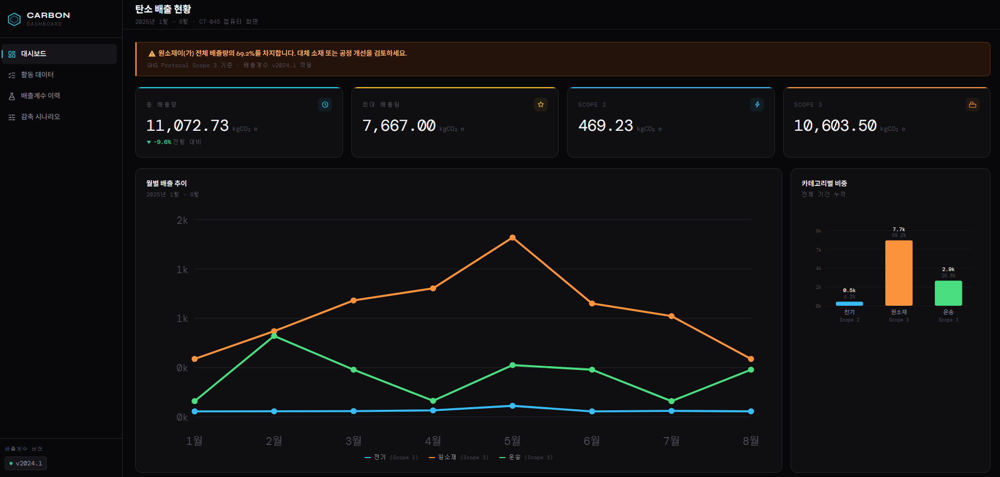
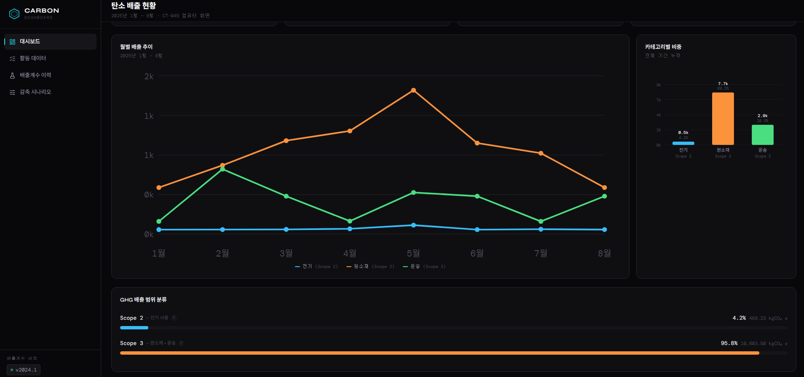
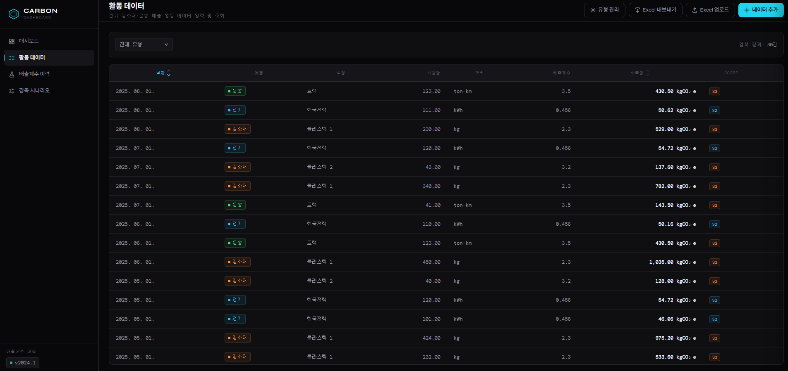
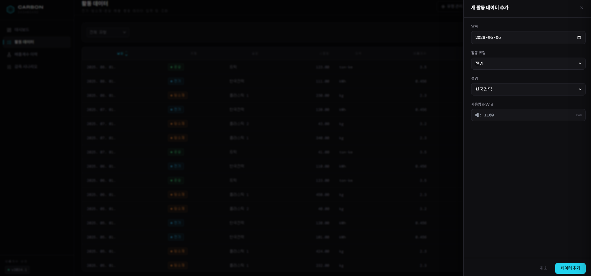
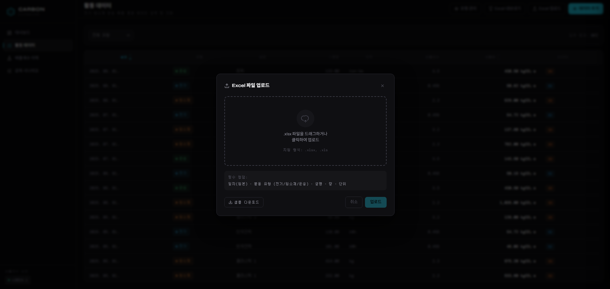
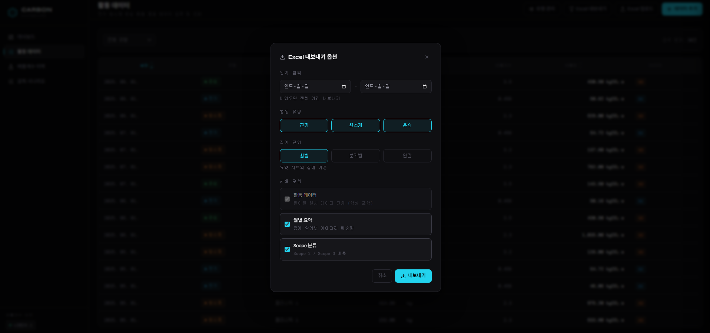
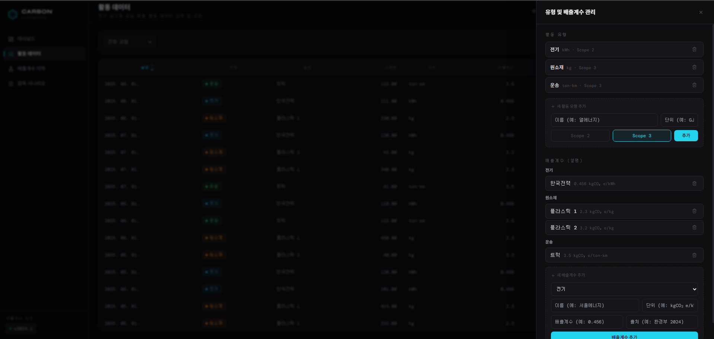
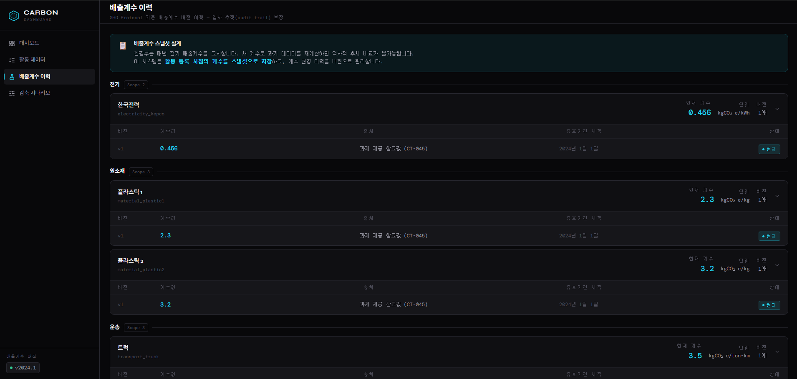
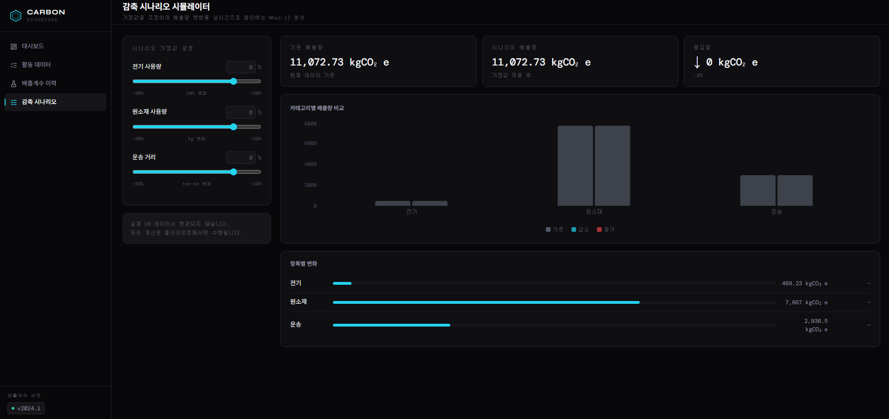
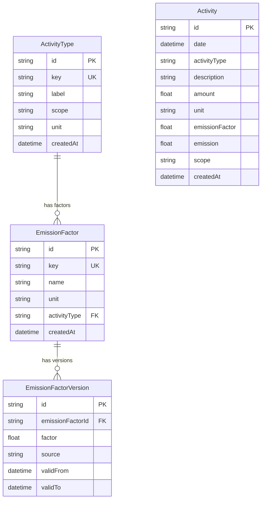

# Carbon Dashboard — PCF 탄소 배출 관리 플랫폼

제조업 실무자와 경영자를 위한 제품 탄소 발자국(PCF) 추적·시각화 대시보드입니다.  
전기·원소재·운송 데이터를 입력하면 GHG Protocol 기준 Scope 2/3 배출량을 자동 계산합니다.

🔗 **배포 링크**: https://carbon-dashboard-production.up.railway.app  
📹 **데모 영상**: [demo.mp4](screenshots/test.mp4)  
📁 **GitHub**: https://github.com/bellkong7079/carbon-dashboard

---

## 주요 기능

| 페이지 | 경로 | 설명 |
|--------|------|------|
| 대시보드 | `/` | 월별 배출 추이, Scope 별 비중, 카테고리별 바차트, KPI 카드 |
| 활동 데이터 | `/activities` | 데이터 목록·추가·삭제, Excel 업로드·내보내기 |
| 배출계수 이력 | `/emission-factors` | 계수 버전 이력 조회, 현재/만료 배지, 감사 추적 |
| 감축 시나리오 | `/scenario` | 슬라이더 + 숫자 입력으로 감축률 조정 → What-if 시뮬레이션 |

---

## 로컬 실행 방법

```bash
# 1. 저장소 클론 및 의존성 설치
git clone https://github.com/bellkong7079/carbon-dashboard
cd carbon-dashboard && yarn install

# 2. 환경 변수 설정
cp .env.example .env.local
# .env.local 열어서 DATABASE_URL 입력 (로컬 PostgreSQL 또는 Neon)

# 3. DB 실행 (Docker 사용 시)
docker-compose up -d

# 4. 마이그레이션 및 시드 데이터 입력
npx prisma migrate deploy
npx prisma db seed

# 5. 서버 실행
yarn start
```

→ http://localhost:3000 접속

---

## 스크린샷

### 대시보드 — KPI · 월별 추이


### 대시보드 — GHG Scope 분류


### 활동 데이터 목록


### 활동 데이터 입력 폼


### Excel 업로드


### Excel 내보내기 옵션


### 유형 및 배출계수 관리


### 배출계수 버전 이력


### 감축 시나리오 시뮬레이터


---

## 기술 스택 및 선택 이유

| 기술 | 선택 이유 |
|------|-----------|
| Next.js 14 App Router | 프론트+백엔드 통합, API Route Handler로 REST 직접 구현 |
| Prisma 5 + PostgreSQL | 타입 안전한 DB 접근, 배출계수 버전 이력 스키마 표현에 최적 |
| Recharts | SSR-safe Client Component 차트, 애니메이션·반응형 기본 지원 |
| SheetJS (xlsx) | Excel 업로드·다운로드 양방향 지원, 멀티시트 내보내기 |
| zod + react-hook-form | 런타임 유효성 검사 + TypeScript 타입 자동 추론, 폼 에러 UX |
| CSS Variables 다크 테마 | 일관된 디자인 토큰 시스템, 라이브러리 의존 없이 유지 보수 용이 |
| Neon (Serverless PostgreSQL) | 서버리스 환경(Netlify Functions)에서 TCP 연결 안정적 지원 |

---

## 시스템 설계 — ERD



**핵심 설계 포인트**
- `Activity.emissionFactor`: 계산 시점의 배출계수를 스냅샷으로 저장 → 감사 추적 보장
- `EmissionFactorVersion.validTo = null`: 현재 유효한 버전을 null로 표시 (soft delete 패턴)
- `Activity.scope`: Scope 2(전기), Scope 3(원소재·운송) GHG Protocol 기준 분류
- `ActivityType`: 활동 유형을 DB로 동적 관리 — 하드코딩 없이 신규 유형 추가 가능

---

## 설계 결정 이유

### ① Activity에 emissionFactor를 스냅샷으로 저장
배출계수는 환경부 고시에 따라 매년 갱신됩니다.  
최신 계수로 과거 데이터를 재계산하면 역사적 추세 비교가 불가능해집니다.  
계산 시점의 계수를 스냅샷으로 저장해 감사 추적(audit trail)을 보장합니다.

### ② emission을 미리 계산하여 저장 (반정규화)
집계 API에서 매번 amount × factor를 계산하면 데이터 증가 시 DB 부하가 커집니다.  
저장 시 한 번 계산해 조회 성능을 최적화했습니다.  
(trade-off: 배출계수 변경 시 과거 데이터 재계산 배치 필요)

### ③ API Route Handler 사용 (Server Actions 미사용)
Excel 업로드, 외부 시스템 연동 가능성, Swagger 문서화를 고려하면  
명시적 REST API가 장기적으로 확장성이 좋습니다.

---

## 설계 Trade-off

### 반정규화 (emission 미리 계산 저장) vs 정규화 (조회 시 계산)

| 방식 | 장점 | 단점 |
|------|------|------|
| 미리 계산 저장 (채택) | 조회 성능 우수, 쿼리 단순 | 배출계수 변경 시 재계산 배치 필요 |
| 조회 시 실시간 계산 | 항상 최신 계수 반영 | 데이터 증가 시 집계 쿼리 느려짐 |

→ 탄소 회계에서 감사 추적이 중요하므로 스냅샷 + 미리 계산 방식 선택.  
  배출계수 변경 빈도가 낮고(연 1회 수준) 데이터가 증가할수록 조회 성능 이점이 큼.

---

## GHG Protocol Scope 분류

| Scope | 정의 | 이 프로젝트 |
|-------|------|-------------|
| Scope 1 | 직접 배출 (자체 연소 등) | 미포함 |
| Scope 2 | 구매 전기·열 사용 간접 배출 | 전기 (한국전력) |
| Scope 3 | 공급망 전반 간접 배출 | 원소재 조달, 운송 |

출처: GHG Protocol Corporate Standard (www.ghgprotocol.org)

---

## 타 시스템 비교

| 항목 | 이 시스템 | Salesforce Net Zero Cloud | Microsoft Sustainability Manager |
|------|-----------|--------------------------|----------------------------------|
| 주요 대상 | 단일 제품 PCF | 기업 전체 탄소 관리 | 기업 전체 ESG |
| 배출계수 관리 | 버전 이력 추적 + 동적 추가 | 내장 배출계수 DB | 내장 배출계수 DB |
| What-if 시뮬레이션 | ✅ 시나리오 페이지 | 제한적 | 제한적 |
| Excel 임포트 | ✅ 원본 그대로 지원 | ✅ 지원 | ✅ 지원 |
| 커스터마이징 | 높음 (오픈소스) | 낮음 (SaaS) | 낮음 (SaaS) |
| 비용 | 오픈소스 무료 | 고가 엔터프라이즈 | 고가 엔터프라이즈 |
| 배포 | Netlify + Neon | 클라우드 SaaS | 클라우드 SaaS |
| 적합 대상 | 스타트업·중소기업 | 대기업 | 대기업 |

→ 이 시스템은 빠른 도입과 커스터마이징이 필요한 중소 제조사에 최적화되어 있습니다.

---

## AI 도구 사용 내역

> 모든 코드 생성에 **Claude Code (claude-sonnet-4-6)** 를 사용했습니다.  
> 아래는 주요 작업별 프롬프트 요약과 직접 판단한 내용입니다.

| 작업 | 프롬프트 요약 | AI 역할 | 직접 판단한 부분 |
|------|--------------|---------|----------------|
| 전체 구조 설계 | "PCF 탄소 관리 대시보드 — Next.js 14, Prisma, API Route, 다크 UI" | 프로젝트 뼈대 생성 | 컴포넌트 분리 기준, 페이지 구성 결정 |
| DB 스키마 설계 | "배출계수 버전 이력 추적 Prisma 스키마 — EmissionFactor, EmissionFactorVersion" | ERD 초안 생성 | 스냅샷 저장 패턴 채택 이유 판단 |
| API Route 구현 | "활동 CRUD + 집계 API — 월별/Scope별/카테고리별 통계" | 전체 라우트 구현 | 반정규화(emission 미리 계산) 선택 |
| 대시보드 UI | "Recharts 월별 라인차트, 카테고리 바차트, Scope 도넛차트, KPI 카드" | 차트 컴포넌트 구현 | 실무자/경영자 직관적 설계 방향 |
| Excel 기능 | "SheetJS 업로드(과제 원본 Excel 그대로 임포트) + 멀티시트 내보내기" | 파서·생성기 구현 | 컬럼 매핑 로직 직접 검증 |
| 폼 유효성 검사 | "zod + react-hook-form 실시간 에러 메시지, 배출량 미리보기" | 스키마 + UI 구현 | 에러 메시지 한국어 문구 직접 작성 |
| 활동 유형 동적 관리 | "ActivityType DB 테이블 + CRUD API + FactorManager UI" | 스키마·API·컴포넌트 구현 | 하드코딩 제거 범위 판단 |
| Excel 내보내기 세분화 | "활동 유형 필터 토글 + 월별/분기별/연간 집계 단위 선택" | 옵션 UI + 집계 로직 구현 | 경영진 대상 집계 단위 필요성 판단 |
| 배출계수 이력 페이지 | "감사 추적용 EmissionFactorVersion 이력 조회 페이지" | 페이지 구현 | 현재/만료 배지 UX 직접 설계 |
| 시나리오 시뮬레이터 | "What-if 감축 시나리오 — 슬라이더 + 숫자 입력, Recharts 비교 바차트" | 시뮬레이션 로직 + UI 구현 | DB 미변경 클라이언트 전용 판단 |
| 배포 트러블슈팅 | "Netlify Functions에서 Prisma 500 에러 디버깅" | 원인 분석 + 수정 | pg TCP 어댑터 전환 최종 판단 |
| README | "채용과제 README — trade-off, 설계 이유, ERD, AI 사용 내역 포함" | 문서 초안 생성 | 수치 정확성·설계 이유 직접 검토 후 수정 |

**AI를 사용하지 않은 부분**
- 배출량 계산 수치 검증 (amount × emissionFactor 직접 대조)
- 시드 데이터 29개 행 과제 원본과 정합성 확인
- 배포 환경변수 누락 문제 최종 진단
- 시나리오 페이지 DB 미변경 방침 결정 (클라이언트 전용 시뮬레이션)

---

## 자가 체크리스트

| 구분 | 항목 | 상태 |
|------|------|------|
| 필수 | PCF 계산 시각화, 직관적 이해 | ✅ |
| 필수 | 데이터 값 정확, 단위 표시 | ✅ |
| 필수 | 오류 입력 시 에러 메시지 | ✅ |
| 필수 | UI 비디오캡처 + 스크린샷 | ⬜ 촬영 필요 |
| 필수 | README 로컬 실행 5단계 이내, yarn start 실행 | ✅ |
| 필수 | README AI 사용 내역 | ✅ |
| 필수 | README 설계 설명 포함 | ✅ |
| 필수 | GitHub public + 커밋 히스토리 | ✅ |
| 권장 | ERD/스키마 다이어그램 | ✅ |
| 권장 | 발표 "왜 이렇게 설계했는가" 2개 이상 | ✅ (3개) |
| 권장 | 설계 trade-off 1개 이상 | ✅ |
| 보너스 | Docker Compose 즉시 실행 | ✅ |
| 보너스 | 과제 Excel 그대로 임포트 | ✅ |
| 보너스 | OpenAPI / Swagger 문서 | ✅ `/api/swagger` |
| 보너스 | 타 시스템 비교 | ✅ |
